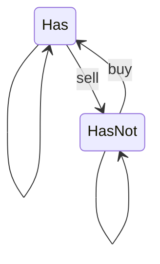

Stockを持っている状態と持っていない状態を考えれば良い。最終日で株を持っていない状態が最大の利益がある。



1st

```python
class Solution:
    def maxProfit(self, prices: List[int]) -> int:
        max_profit_with_stock = [0] * len(prices)
        max_profit_without_stock = [0] * len(prices)

        max_profit_with_stock[0] = - prices[0]

        for i in range(1, len(prices)):
            max_profit_with_stock[i] = max(
                max_profit_with_stock[i - 1],
                max_profit_without_stock[i - 1] - prices[i]
            )
            max_profit_without_stock[i] = max(
                max_profit_without_stock[i - 1],
                max_profit_with_stock[i - 1] + prices[i]
            )
        
        return max_profit_without_stock[-1]
```


2nd

LeetCodeの解法を見た。底で買って天井で売るを繰り返す。
```python
class Solution:
    def maxProfit(self, prices: List[int]) -> int:
        def find_first_lowest(from_index):
            index = from_index
            while index < len(prices) - 1 and prices[index] >= prices[index + 1]:
                index += 1
            return index
        
        def find_first_highest(from_index):
            index = from_index
            while index < len(prices) - 1 and prices[index] <= prices[index + 1]:
                index += 1
            return index

        max_profit = 0
        index = 0
        while index < len(prices):
            valley_index = find_first_lowest(index)
            peak_index = find_first_highest(valley_index)

            max_profit += prices[peak_index] - prices[valley_index]
            index = peak_index + 1
        return max_profit
```

上の解法を進めると前日より上がっていれば売れば良い。
たとえば、`[1, 3, 7]`とあったときに「1で買って7で売る」のと「1で買って3で売って、3で買って7で売る」のはおなじになる。

```python
class Solution:
    def maxProfit(self, prices: List[int]) -> int:
        max_profit = 0
        for i in range(1, len(prices)):
            if prices[i] > prices[i - 1]:
                max_profit += prices[i] - prices[i - 1]
        return max_profit
```


3rd
```python
class Solution:
    def maxProfit(self, prices: List[int]) -> int:
        max_profit = 0
        for i in range(1, len(prices)):
            if prices[i] > prices[i - 1]:
                profit = prices[i] - prices[i - 1]
                max_profit += profit
        return max_profit
```
