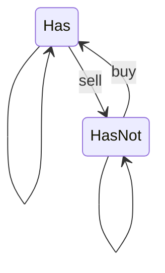

Stockを持っている状態と持っていない状態を考えれば良い。最終日で株を持っていない状態が最大の利益がある。



1st

```python
class Solution:
    def maxProfit(self, prices: List[int]) -> int:
        max_profit_with_stock = [0] * len(prices)
        max_profit_without_stock = [0] * len(prices)

        max_profit_with_stock[0] = - prices[0]

        for i in range(1, len(prices)):
            max_profit_with_stock[i] = max(
                max_profit_with_stock[i - 1],
                max_profit_without_stock[i - 1] - prices[i]
            )
            max_profit_without_stock[i] = max(
                max_profit_without_stock[i - 1],
                max_profit_with_stock[i - 1] + prices[i]
            )
        
        return max_profit_without_stock[-1]
```


2nd


3rd
